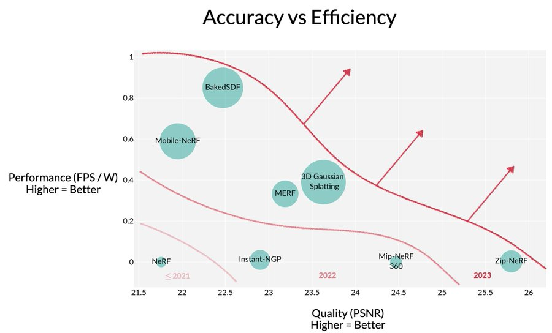

# NeRF

Maintainers - [Aaron Zhao](https://aaron-zhao123.github.io/) and [Cheng Zhang](https://chengzhang-98.github.io/blog/)

A curated list of neural radiance field (NeRF) papers. 

## Table of Contents

- [Papers](#papers)
- [Surveys](#surveys)

---

## Papers

|  Title  |   Year   |   Venue  |   Code   |   Notes  |
|:--------|:--------:|:--------:|:--------:|:--------:|
| [NeRF: Representing Scenes as Neural Radiance Fields for View Synthesis](https://arxiv.org/abs/2003.08934) | 2020 | ECCV | [TF (Original)](https://github.com/bmild/nerf); [Torch](https://github.com/yenchenlin/nerf-pytorch) | [Notes](#nerf-representing-scenes-as-neural-radiance-fields-for-view-synthesis) |
| [ICARUS: A Specialized Architecture for Neural Radiance Fields Rendering](https://arxiv.org/pdf/2203.01414.pdf) | 2022 | Arxiv | - | - |
| [Gen-NeRF: Efficient and Generalizable Neural Radiance Fields via Algorithm-Hardware Co-Design](https://dl.acm.org/doi/abs/10.1145/3579371.3589109) | 2023 | ISCA | - | - 
| [A Novel Hardware Accelerator of NeRF Based on Xilinx UltraScale and UltraScale+ FPGA](https://ieeexplore.ieee.org/abstract/document/10296239) | 2023 | FPL | - | - 
| [An Energy Efficient Precision Scalable Computation Array for Neural Radiance Field Accelerator](https://ieeexplore.ieee.org/abstract/document/10090268) | 2022 | APCCAS | - | -
| [Zip-NeRF: Anti-Aliased Grid-Based Neural Radiance Fields](https://jonbarron.info/zipnerf/) | 2023 | ICCV | - | -
| [Mip-NeRF 360: Unbounded Anti-Aliased Neural Radiance Fields](https://jonbarron.info/mipnerf360/) | 2022 | CVPR | - | -
| [Efficient Neural Radiance Fields for Interactive Free-viewpoint Video](https://zju3dv.github.io/enerf/) | 2022 | SIGGRAPH | - | -
| [FastNeRF: High-Fidelity Neural Rendering at 200FPS](https://microsoft.github.io/FastNeRF/) | 2021 | - | - | -
| [Hardware Acceleration of Neural Graphics](https://arxiv.org/pdf/2303.05735.pdf) | 2023 | ICSA | - | -

---
## Surveys

|  Title  |   Year   |   Venue  |   Code   |
|:--------|:--------:|:--------:|:--------:|
| [NeRF: Neural Radiance Field in 3D Vision, Introduction and Review](https://arxiv.org/pdf/2210.00379.pdf) | - | - | - |

---

## [Pareto Frontier of real time view synthesis (2023)](https://twitter.com/jon_barron/status/1707068958502003074): 

This guy does alot of NeRF research:
https://jonbarron.info/

## Notes

### NeRF: Representing Scenes as Neural Radiance Fields for View Synthesis

This is the first paper introducing NeRF. A 3D scene is modelled as a radiance field - a 5D continuous function mapping each point in the scene, and the direction at which the point is being observed, to a colour and opacity. The inputs to this function are the 3D coordinates of a point in the scene and the 2D 'viewing direction' (the direction from which the point is being observed). The output of the function is the RGB colour of the point, and the colour density of the point.

The authors find that the radiance field function can be approximated by a shallow MLP. A NeRF dataset consists of many pictures of a single scene taken from different viewing directions. Points in the scene are sampled by shooting camera rays from different pixels of a view. The MLP is trained to reduce the loss between the predicted colour and density of a point and its 'real' value obtained by sampling. 

(This explanation is very simplified.)

# Overview

https://neuralradiancefields.io/research/page/2/

NeRF - representing a radiance field function using a neural network

NeRF is just one of a family of Neural Graphics algorithms. 

- Neural Radiance Field (NeRF)
- GigaPixel Image Approximation (GIA)
- Neural Volume Rendering (NVR)

Neural Graphics Pipeline:

1) Input stage
    a) Fixed-function encoding
    b) Multiresolution grid encoding
    c) 
2) Neural Inference stage
    This is a learned mapping from spatial coordinates to colours and volumes. 
    
3) Compositing stage

LUTNET
- not used in PolyLUT paper
- we already have fixed, binary, ternary and LogicNets. Sufficient search space
- too much engineering work to implement

# NeRF
- engineering effort is too high - too many unknowns - unfeasible given time constraints

NerF flow
x -> MLP -> y 

x - N dim feature vector (encoding of spatial coordinate)
y - 4D feature vector (R,G,B, density)

What we need:
1) Latency of this flow
2) Accuracy of this flow
    - We can't actually measure the accuracy of the MLP based on just one input output pair. We need to use the whole image.
    - This is because we need to compare the difference between all the pixels of a ground truth image and the rendered image.
    
    - Naive way of doing this:
        i) Store all the sampled points in an array (SW) (too many samples here?)
        ii) Apply MLP to each element in array (HW)
        iii) Post process array of MLP outputs to render image (SW)

Complexity: 
- Accuracy is not simply a pairwise loss